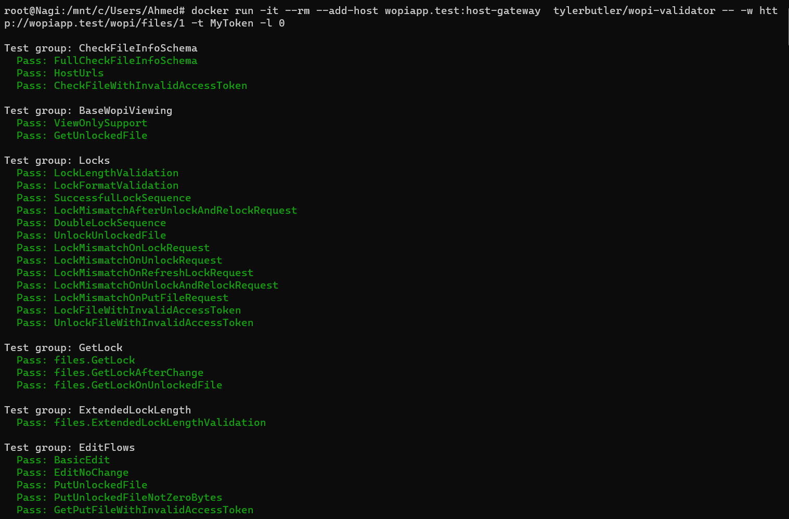
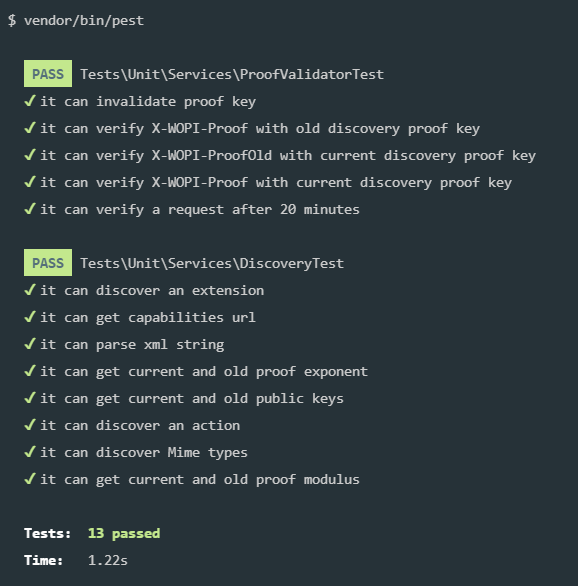

# Laravel Wopi Host

<!-- Office wopi banner with a like to officewopi.com -->
<!--  -->

  

---

Implementation of the WOPI protocol to facilitate intergration with office online and other WOPI-compatible clients using Laravel.

## 📃 Description

Web Application Open Platform Interface (**WOPI**) protocol let you integrate Office in your web application.

WOPI protocol enables Office for the web to access and change files that are stored in your service.
**Basically it allows you to create Google Docs at the confert of your localhost/application.**

Supports:

-   [Collabora Office](https://www.collaboraoffice.com/) (Recommended)
-   [Office 365](https://www.office.com/) (in-progress)
-   [OnlyOffice](https://www.onlyoffice.com/en/about.aspx)

## 📕 Documentation

You'll find the documentation on [https://nagi1.github.io/laravel-wopi/docs](https://nagi1.github.io/laravel-wopi/docs).

Find yourself stuck using the package? Found a bug? Do you have general questions or suggestions for improving the wopi implementation? Feel free to create an issue on GitHub, we'll try to address it as soon as possible.

## ⚡ Demo/Example

Demo app can be found at [https://github.com/nagi1/wopi-host-example](https://github.com/nagi1/wopi-host-example)

## 🧪 Tested

This package has been tested using [Wopi Validator](https://github.com/microsoft/wopi-validator-core).

👇👇👇

test Proof-validator `vendor/bin/pest`.

👇👇👇

To enable the [Interactive WOPI Validation](https://learn.microsoft.com/pt-br/microsoft-365/cloud-storage-partner-program/online/build-test-ship/validator), adapt the WOPI configuration:

* client_url: Ensure using Office 365
* enable_interactive_wopi_validation: Set to `true`

Warning: This will mock any valid file to be the `.wopitest` file, and therefore will be destroyed when running tests.

## ⚠ Important

This package isn't fully ready to work with Microsoft Office online because it lacks the ability to parse discovery urls. Feel free to Open PR or contact me to work on this togher in case you need it.

## Credits

-   [Ahmed Nagi](https://github.com/nagi1)

This project build upon and extends but not limited to Pol Dellaiera's [Wopi-lib](https://github.com/Champs-Libres/wopi-lib).

## License

The MIT License (MIT). Please see [License File](LICENSE.md) for more information.
